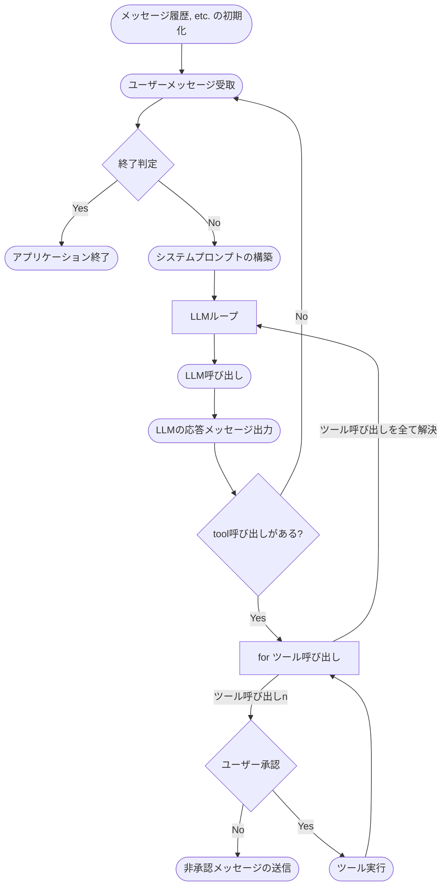

## はじめに

EpicAIの吉崎です。

先日、弊社の佐藤さんが書かれた『Claude CodeのOSS版 OpenCodeの内部挙動を理解する』という記事が公開されました。

https://zenn.dev/epicai_techblog/articles/20b78066cac63f

こちらの記事では、OpenCodeにおけるユーザーの要求がテキストで入力されてから最終的にクエリが消化されるまでの流れがステップごとに解説されており、コーディングエージェントという巨大なAgentを理解する上でとても参考になりました。

自分も以前からコーディングエージェントに強い興味を持っており、Agentがどの様な状態遷移をたどるのか、どのようなソフトウェア的な設計によってよくあるチャットサービスで呼び出されるLLMがコーディングを自律的に行うほどの能力を獲得できるのかを理解したいと思っていました。

この記事に背中を押される形で、今回はミニマルな**コーディングエージェントの自作**を行うことでAIエージェントをより実装に近いレベルで理解しつつ、自作エージェントの出力を観察してソフトウェア的な勘所が何なのかを肌感覚で知ろう、というのが本記事の目的です。

## 本記事の構成

本記事の構成は以下の通りです。本記事を書く上で作成したCLIベースのコーディングエージェント"**Microde CLI**"の設計・実装を解説しつつ、最終的にブロック崩しゲームを作るタスクを解かせてその出力過程を観察します。

**第1部: 設計編**
処理の全体像
Rigとは
**第2部: 実装解説編**
システムプロンプトの構築
メッセージ履歴の管理
LLMの呼び出し
ツール解決と承認
コンテキストウィンドウとコンパクション
各ツールの実装詳細
**第3部: 成果物編**
ブロック崩しを作らせる
コーディングエージェントとは結局なんなのか
今後の発展

:::message
本記事で作成したコーディングエージェントは、実装の一部をClaude Codeが担っています。
また、Microde CLIはコーディングエージェントの骨子を理解するために開発された学習目的のプロジェクトです。上述の佐藤さんの記事で解説されている機能や、OpenCodeを含むOSSのコーディングエージェントの機能全てを実装したものではありません。
:::

AIレビュー機能やClaude Codeを使って本記事の妥当性や正確性を複数回検証しましたが、誤りが含まれる場合があります。もし誤りがあればご指摘いただけますと助かります。

## 処理の全体像
今回開発したコーディングエージェントの処理フローは大まかに以下の流れに沿っています。

1. ユーザーメッセージの受取
ユーザーからのメッセージを受け取ります。もしユーザーメッセージが"exit"なら、アプリケーションを終了します。
2. システムプロンプトの構築
固有のプロンプトやAGENTS.md等のファイル, 環境情報からシステムプロンプトを構築します。
3. LLM呼び出し
基盤モデルを呼び出します（今回の場合はClaude 4.6 Sonnetで固定)
5. LLMからの応答処理
応答を処理します。ツール呼び出しがなければLLMからのメッセージを表示して終了しますが、ツール呼び出しがある場合はツール解決を行います
6. ツール解決
ツール呼び出しが行われた場合、パーミッションチェック→ツール実行が行われます。
7. コンテキスト管理
メッセージ履歴全体のトークン数がしきい値を超えていた場合、コンテキスト圧縮が行われます。



## 技術選定

### なぜRustなのか

コーディングエージェントの実装言語としては、PythonやTypeScriptが主流です。LangGraphやVercel AI SDKといった成熟したエコシステムが存在し、LLM関連のライブラリやサンプルコードも豊富にあります。

そんな中で今回あえてRustを選んだ理由は、主に2つあります。

1つ目は、将来的に「Codex」を読み解きたいという動機です。OpenAIが公開したコーディングエージェントCodexはRustで実装されており、AIエンジニアとしてコーディングエージェントのOSSとしても巨大かつ品質の高いCodexをいつか実装レベルで読んで理解したいというモチベーションがあります。今回ミニマルなエージェントをRustで自作しておくことで、こうしたより大規模なコードベースを読む際の土台になると考えました。

2つ目は、単純にRustに興味があり、CLIツールを一度Rustで作ってみたかったという点です。Rustは型安全性やパフォーマンスの面で優れており、CLIツールの開発言語としても人気があります（`ripgrep`や`bat`など著名なCLIツールがRustで書かれています）。

後述するようにRustにおけるAI系のフレームワークやライブラリはまだ成熟していませんが、技術的な興味関心とCodexを読みたいという思いからRustを選択しました。

### Rigフレームワーク

RustでLLMアプリケーションを構築するためのフレームワークとして、今回は[Rig](https://github.com/0xPlaygrounds/rig)を採用しました。RigはGitHubスター数6.8kのOSSで、LLMプロバイダーの抽象化・エージェント構築・ツール呼び出しなどの機能を提供しています。

Rigの中心的な抽象は`Agent`です。`Agent`にはLLMとやり取りするための2つのメソッドがあります。

- `chat()`: ツール呼び出しの解決まで含めて内部でループし、最終的なテキスト応答のみを返す高レベルAPI
- `completion()`: LLMの応答をそのまま返し、ツール呼び出しの処理やメッセージ履歴の管理を呼び出し側に委ねる低レベルAPI

今回のプロジェクトでは`completion()`を採用しました。`chat()`はツール呼び出しを内部で自動解決する点で実装が楽ですが、メッセージ履歴の細かい管理やツールが承認なしに実行されてしまうという点で`completion()`に劣ります。また、コーディングエージェントの内部挙動を理解することが目的である以上、ツール呼び出しの解決やコンテキスト管理を自前で実装することに意味があると考えました。

実際のAgent構築は以下のようになります。

```rust
let agent = client
    .agent("claude-sonnet-4-6")
    .preamble(&system_prompt.prompt())  // システムプロンプト
    .tool(Bash)                          // ツールの登録
    .tool(Read)
    .tool(Grep)
    .tool(Grob)
    .tool(FullWrite)
    .build();
```

そして、`completion()`で呼び出すことで、LLMの応答（テキスト＋ツール呼び出し）を自分でハンドリングできます。

```rust
let response = agent
    .completion(prompt, history.to_vec())
    .await?
    .send()
    .await?;
```

:::message
RustにおけるAI/LLM関連のエコシステムは、PythonやTypeScriptと比べるとまだ発展途上です。今回使用したRigについても、公式ドキュメントだけでは解決できない場面があり、ソースコードを直接読んで挙動を確認する必要がありました。同様の試みをされる方がいれば、PythonのLangGraphやTypeScriptのVercel AI SDKなど、コミュニティやドキュメントが充実したフレームワークを使うことをおすすめします。

また、弊社EpicAIでは技術スタックとしてRustを採用することは基本的にありません。この記事で扱う技術選定は完全に筆者個人の趣味によるものです。
:::

# 第2部: 実装解説編

:::message
本章ではMicrode CLIの実装を解説します。コードの抜粋を掲載する際は、出自となるファイルの相対パス（プロジェクトルートからの相対パス）を併記しています。省略した箇所にはコメントで補足を入れています。ソースコード全体は[[GitHubリポジトリ](https://github.com/swkima-dev/microde)]を参照してください。
:::

## ツール選定と実装

### コーディングエージェントに最低限必要なツール

コーディングエージェントが自律的にコードを書くためには、最低限何が必要でしょうか。人間の開発者がエディタとターミナルを使ってコードを書く作業を分解すると、コードを書くという行為は以下の3つの能力に集約されます。

1. ファイル検索 — プロジェクト内のファイルを探し、コードの内容を読む
2. ファイル操作 — コードを新規作成・編集する
3. ターミナル実行 — ビルド、テスト、git操作などのシェルコマンドを実行する

Microde CLIでは、これらをカバーする5つのツールを実装しました。

| ツール | 役割 | 対応する能力 |
|---|---|---|
| `bash` | シェルコマンドの実行 | ターミナル実行 |
| `read` | ファイル・ディレクトリの読み取り | ファイル検索 |
| `grep` | 正規表現によるコード検索 | ファイル検索 |
| `grob` | globパターンによるファイル名検索 | ファイル検索 |
| `write` | ファイルの新規作成・上書き | ファイル操作 |

OpenCodeや Claude Codeでは、これらに加えてedit（差分ベースの部分編集）、webfetch、LSPとの連携など多くのツールが用意されています。今回はミニマルなプロジェクトとしてこの5つに絞りました。editツール（既存ファイルの部分的な書き換え）は入出力トークン数の削減と実用性の観点からあると便利ですが、佐藤さんの記事で解説されているOpenCodeのeditツールはレーベンシュタイン距離を用いた9段階のフォールバック戦略を持つなど実装コストが重く、今回は見送りました。代わりにwriteツールでファイル全体を上書きする方式を採用しています。

### Rigにおけるツールの実装パターン

Rigにおいて各ツールは`Tool`トレイトを実装する構造体として定義します。`Tool`トレイトには2つのメソッドがあります。

- `definition()`: ツールの名前・説明・パラメータのJSONスキーマを返す。LLMはこの情報をもとにツールの呼び出し方を判断する
- `call()`: 実際のツール実行ロジック

以降、bash・read・grepの3つを取り上げて実装を見ていきます。

### bash — シェルコマンドの実行

`src/tool/bash.rs`

bashツールは`tokio::process::Command`でシェルコマンドを非同期実行し、stdout・stderrを結合して返します。

```rust
async fn call(&self, args: BashArgs) -> Result<Self::Output, Self::Error> {
    let timeout_ms = args
        .timeout
        .unwrap_or(DEFAULT_TIMEOUT_MS)
        .min(MAX_TIMEOUT_MS);

    let output = tokio::process::Command::new("bash")
        .arg("-c")
        .arg(&args.command)
        .output();

    let result = tokio::time::timeout(Duration::from_millis(timeout_ms), output).await;

    match result {
        Ok(Ok(output)) => {
            let stdout = String::from_utf8_lossy(&output.stdout);
            let stderr = String::from_utf8_lossy(&output.stderr);
            // exit code, 空出力の処理を行い結果を返す
            // ...
        }
        Ok(Err(e)) => Err(e),
        Err(_) => Err(io::Error::new(
            io::ErrorKind::TimedOut,
            format!("Command timed out after {}ms: {}", timeout_ms, args.command),
        )),
    }
}
```

タイムアウトはデフォルト120秒、最大600秒です。`tokio::time::timeout`でコマンドの実行時間を制限し、超過した場合はエラーを返します。LLMが意図せず長時間実行されるコマンドを呼んだ場合にプロセスが止まらないようにするための措置です。

OpenCodeのbashツールではtree-sitter ASTによるコマンドのセキュリティ検証が行われていますが、Microde CLIでは後述するユーザー承認の仕組みで安全性を担保しており、かつ実装コストも高いだろうと考えたためコマンド自体の静的解析は行っていません。

### read — ファイル・ディレクトリの読み取り

`src/tool/read.rs`

readツールはパスがディレクトリならエントリ一覧を、ファイルなら内容を行単位で返します。

```rust
async fn call(&self, args: ReadArgs) -> Result<Self::Output, Self::Error> {
    let metadata = fs::metadata(&args.path)?;

    if metadata.is_dir() {
        // ディレクトリのエントリ一覧を返す
        // ...
    } else {
        const DEFAULT_LIMIT: usize = 2000;
        let offset = args.offset.unwrap_or(0);
        let limit = args.limit.unwrap_or(DEFAULT_LIMIT);

        let file = File::open(&args.path)?;
        let reader = BufReader::new(file);

        let lines = reader.lines().skip(offset).take(min(limit, DEFAULT_LIMIT));

        let mut joined_string = String::new();
        for line_result in lines {
            let line = line_result?;
            joined_string.push_str(&line);
            joined_string.push('\n');
        }
        Ok(joined_string)
    }
}
```

デフォルトで最大2000行を返し、`offset`と`limit`で読み取り範囲を指定できます。巨大なファイルを全てコンテキストに載せるとトークンを大量に消費するため、必要な範囲だけを読む手段を用意しています。

### grep — 正規表現によるコード検索

`src/tool/grep.rs`

grepツールはRustの`regex`クレートを使い、ファイルまたはディレクトリを対象に正規表現検索を行います。

```rust
async fn call(&self, args: GrepArgs) -> Result<Self::Output, Self::Error> {
    let regex = Regex::new(&args.pattern).map_err(io::Error::other)?;
    let path = Path::new(&args.path);
    let mut results = Vec::new();

    if path.is_file() {
        search_file(&regex, path, &mut results)?;
    } else if path.is_dir() {
        search_dir(&regex, path, &mut results)?;
    }

    Ok(results.join("\n"))
}
```

ディレクトリが指定された場合は再帰的にファイルを走査します。結果は`パス:行番号: 内容`の形式で返されます。

```rust
fn search_file(regex: &Regex, path: &Path, results: &mut Vec<String>) -> io::Result<()> {
    let file = fs::File::open(path)?;
    let reader = BufReader::new(file);

    for (line_num, line_result) in reader.lines().enumerate() {
        let line = line_result?;
        if regex.is_match(&line) {
            results.push(format!("{}:{}: {}", path.display(), line_num + 1, line));
        }
    }
    Ok(())
}
```

grepとgrob（globパターンによるファイル名検索）を分けて実装しているのは、「ファイルの中身を検索したい」ケースと「ファイル名で探したい」ケースを明確に区別するためです。LLMがツールを選択する際に、ツールの役割が明確であるほど適切な判断がしやすくなります。

## システムプロンプトの構築

`src/system_context/mod.rs`

システムプロンプトは、LLMに対してエージェントとしての振る舞いを指示するための文脈情報です。Microde CLIでは、以下の3つの要素からシステムプロンプトを毎回組み立てています。

1. 固定のベースプロンプト（`src/system_context/system.txt`に定義）
2. 環境情報（作業ディレクトリ、git workspaceのルート）
3. インストラクションファイル（`AGENTS.md`、`MICRODE.md`、`CONTEXT.md`のいずれか）

```rust
pub fn prompt(&self) -> String {
    let instruction = self
        .instruction
        .as_ref()
        .and_then(|path| fs::read_to_string(path).ok())
        .unwrap_or_default();

    format!(
        "{}\n<env>\nWorking directory: {:?}\nWorkspace root folder: {:?}\n</env>\n{}",
        self.system_prompt, self.working_dir, self.workspace_root_dir, instruction,
    )
}
```

ベースプロンプトはシンプルで、エージェントとしての基本的な役割を定義しているだけです。
(OpenCodeのベースプロンプトの上から数行を拝借し、書き換えました。)

```
You are Microde, the coding agent.

You are an interactive CLI tool that helps users with software engineering tasks.
Use the instructions below and the tools available to you to assist the user.
```

インストラクションファイルは、プロジェクト固有の指示をエージェントに伝える仕組みです。ワークスペースルートに`AGENTS.md`・`MICRODE.md`・`CONTEXT.md`のいずれかがあれば、その内容がシステムプロンプトに追加されます。Claude Codeにおける`CLAUDE.md`に相当する機能です。

```rust
fn find_instruction_file(root: &Path) -> Option<PathBuf> {
    let candidates = ["AGENTS.md", "MICRODE.md", "CONTEXT.md"];

    candidates
        .iter()
        .map(|name| root.join(name))
        .find(|path| path.exists())
}
```

システムプロンプトはLLMループのたびに再構築されます。これは、コーディングエージェントによるツール実行などでインストラクションファイルが変わる可能性があるためです。

```rust
let agent = client
    .agent("claude-sonnet-4-6")
    .preamble(
        &system_prompt
            .update_working_dir()   // 作業ディレクトリを再取得
            .reload_instruction()   // インストラクションファイルを再読み込み
            .prompt(),
    )
    // ...
    .build();
```

:::details 弁明: なぜ作業ディレクトリを再取得しているか
Microde CLIでは、基本的に作業ディレクトリが変わることを想定していません。あえて取得している理由は、エージェントが誤って作業ディレクトリを削除した場合にパニックを起こしプログラムを終了するためです。
しっかりとしたアプリケーションにするなら、こういった事後的な検知かつパニックを引き起こす実装ではなく、そもそも作業ディレクトリ以上の階層をrmできないような仕組みを実装するほうが良いでしょう。`bash`ツールの節でも触れたとおり、現実に使われるようなエージェントを設計するのであればコマンドのセキュリティ検証をするべきです。
:::

OpenCodeではモデル別にシステムプロンプトを切り替える仕組みがありますが（Claude向け、GPT向けなど）、Microde CLIではモデルをClaude Sonnet 4.6に固定しているため、この切り替え機構は実装していません。

## メッセージ履歴の管理

`src/memory.rs`

メッセージ履歴の管理は、コーディングエージェントの中核を担う仕組みの一つです。LLMはステートレスであり、過去のやり取りを「覚えている」わけではありません。毎回のAPI呼び出し時に、過去の会話履歴を全てリクエストに含める必要があります。

Microde CLIでは`ConversationMemory`構造体で会話履歴を管理しています。

```rust
pub struct ConversationMemory {
    messages: Vec<Message>,
    max_tokens: u64,
    /// Approximate token count, derived from the latest API response's total_tokens.
    current_tokens: u64,
}
```

`messages`に会話の全履歴を保持し、`current_tokens`で現在のトークン消費量を追跡します。トークン数はAPIレスポンスの`usage.total_tokens`から取得しており、自前で推定するのではなくAPIの実測値を使っています。

メッセージの種類に応じて4つのpushメソッドがあります。

```rust
pub fn push_user(&mut self, input: &str) {
    self.messages.push(Message::user(input));
}

pub fn push_assistant<T>(&mut self, response: &CompletionResponse<T>) {
    self.current_tokens = response.usage.total_tokens;
    self.messages.push(Message::Assistant {
        id: None,
        content: response.choice.clone(),
    });
}

pub fn push_tool_result(&mut self, tool_call_id: &str, result: String) {
    self.messages.push(Message::User {
        content: OneOrMany::one(UserContent::ToolResult(ToolResult {
            id: tool_call_id.to_string(),
            call_id: None,
            content: OneOrMany::one(ToolResultContent::text(result)),
        })),
    });
}
```

注目すべきは`push_tool_result()`です。ツールの実行結果はAnthropic APIの仕様上、`user`ロールのメッセージとして`ToolResult`型で送信する必要があります。RigはこのAPIの仕様を`UserContent::ToolResult`として抽象化しており、`tool_call_id`で対応するツール呼び出しと結果を紐づけます。

## LLMの呼び出し

`src/main.rs`

LLMの呼び出しは、メインループの中核部分です。Rigの`completion()`を使い、最新のメッセージをプロンプトとして、それ以前の履歴をコンテキストとして渡します。

```rust
loop {
    let messages = main_memory.messages();
    let (prompt, history) = messages.split_last().expect("messages should not be empty");
    let prompt = prompt.clone();

    let sp = spinner();
    sp.start("Thinking...");
    let response = agent
        .completion(prompt, history.to_vec())
        .await?
        .send()
        .await?;
    sp.stop("Done");

    let text = util::extract_text(&response.choice);
    if !text.is_empty() {
        log::info(format!("Assistant\n{}", text))?;
    }
    main_memory.push_assistant(&response);

    // ツール呼び出しの有無を確認し、なければループを抜ける
    let has_tool_calls = response
        .choice
        .iter()
        .any(|c| matches!(c, AssistantContent::ToolCall(_)));

    if !has_tool_calls {
        break;
    };

    // ツール解決（後述）
    // ...
}
```

`response.choice`にはLLMの応答がテキストとツール呼び出しの混在した形で含まれています。テキスト部分を表示した後、ツール呼び出しがあればループを継続し、なければ抜けてユーザーの次の入力を待ちます。

OpenCodeではVercel AI SDKを通じてストリーミング処理（テキストが生成されるたびにリアルタイムで表示）を行っていますが、Microde CLIではレスポンス全体を受け取ってから表示する方式を採用しています。ストリーミング処理はUXの改善には寄与しますが、エージェントの動作原理の理解には直接関係しないため、今回のプロジェクトでは実装していません。

## ツール解決と承認

`src/main.rs`

LLMの応答にツール呼び出しが含まれていた場合、各ツールを順番に解決します。Microde CLIでは全てのツール呼び出しに対してユーザーの承認を求めます。

```rust
for content in response.choice.iter() {
    if let AssistantContent::ToolCall(tool_call) = content {
        let name = &tool_call.function.name;
        let args = &tool_call.function.arguments;

        let approved = confirm(format!("Allow tool call: {name}({args})"))
            .initial_value(true)
            .interact()?;

        if approved {
            let sp = spinner();
            sp.start(format!("Running {name}..."));
            let result = main_tool.call(name, args.to_string()).await?;
            sp.stop(format!("{name} completed"));
            main_memory.push_tool_result(&tool_call.id, result);
        } else {
            log::warning("Tool call denied")?;
            main_memory.push_tool_result(
                &tool_call.id,
                format!(
                    "Tool use was denied by user. Denied tool call: {}, {}",
                    name, args,
                ),
            );
        }
    }
}
```

ユーザーがツール呼び出しを拒否した場合も、その事実を`push_tool_result()`でメッセージ履歴に記録します。これにより、LLMは「ツールが拒否された」ことを認識し、別のアプローチを検討できます。

ここでの`main_tool`はRigの`ToolSet`で、事前に登録したツール群からツール名で呼び出しを解決します。

```rust
let mut main_tool = ToolSet::default();
main_tool.add_tool(Bash);
main_tool.add_tool(Read);
main_tool.add_tool(Grep);
main_tool.add_tool(Grob);
main_tool.add_tool(FullWrite);
```

OpenCodeではツールごとに読み取り・書き込み・ネットワークなどの権限カテゴリが設定され、ユーザーが事前に許可レベルを設定できます。Microde CLIではこの粒度の権限管理は実装コストが大きいため見送り、全ツール一律で承認を求めるシンプルな方式としています。

## コンテキストウィンドウとコンパクション

`src/memory.rs`, `src/subagent/compaction.rs`

LLMのコンテキストウィンドウには上限があります。Claude Sonnet 4.6の場合は約100万トークンですが、会話が長くなるとこの上限に達する可能性があります。Microde CLIでは、コンテキストウィンドウの70%（70万トークン）をしきい値として設定し、これを超えた場合にコンパクション（会話履歴の圧縮）を行います。

```rust
// src/main.rs
let mut main_memory = memory::ConversationMemory::new(700_000);
```

コンパクションの判定は、ユーザーとのやりとりが1ターン完了するたびに行います。

```rust
// src/main.rs
if main_memory.should_compact() {
    let sp = spinner();
    sp.start("Compacting conversation history...");
    match subagent::compaction::compaction(&client, main_memory.messages()).await {
        Ok(summary) => {
            main_memory.clear();
            main_memory.push_system(&summary);
            sp.stop("Compaction completed");
        }
        Err(e) => {
            sp.stop("Compaction failed");
            log::warning(format!(
                "Compaction failed, continuing with full history: {e}"
            ))?;
        }
    }
}
```

コンパクションの処理自体は、専用のシステムプロンプトを持つ別のエージェントを呼び出し、会話履歴全体を要約させるという仕組みです。要約が完了したら、既存の履歴をクリアし、要約をシステムメッセージとして保持します。

OpenCodeではコンテキスト管理に3段階のアプローチ（ツール出力のトランケーション、プルーニング、圧縮）が用意されていますが、Microde CLIではコンパクションのみを実装しています。トランケーション（ツール出力の文字数制限）やプルーニング（古いツール出力の選択的削除）は、コンテキストの利用効率を高める有効な手段ですが、今回のミニマルなプロジェクトではコンパクションだけで十分と判断しました。

# 第3部: 成果物編

## ブロック崩しを作らせる

それでは、ここまで解説してきたMicrode CLIに実際にタスクを与えてみましょう。お題は「Pythonでブロック崩しを作る」です。

<!-- TODO: ここに完成したブロック崩しのGIF or スクリーンショットを挿入 -->

以下は、実際のセッションにおけるエージェントの行動を時系列で追ったものです。

### セッションの流れ

ユーザーが与えたプロンプトは一言だけです。

```
pythonでブロック崩しを作ってください。
```

エージェントは即座に「`pygame`ライブラリを使って実装します」と応答し、最初のツール呼び出しを行いました。ここで注目すべきは、**エージェントがユーザーに一切の確認を取らなかった**ことです。ゲームの仕様（画面サイズ、操作方法、機能）はもちろん、使用するライブラリやファイル構成についても質問はありませんでした。

| ステップ | アクション | ユーザー承認 | 備考 |
|:---:|---|:---:|---|
| 1 | `bash`: `pip show pygame \|\| pip install pygame` | **No** | pygameのインストールを試みるが拒否 |
| 2 | `write`: `breakout.py`（ゲームコード全文） | **No** | pip未使用のまま書き込みを試みるが拒否 |
| 3 | テキスト出力でコード全文を表示 | — | ツールが使えないためフォールバック |
| 4 | ユーザー: 「pipではなくuvを使ってください」 | — | ユーザーが方針を修正 |
| 5 | `bash`: `uv init && uv add pygame` | **Yes** | uvでプロジェクト初期化+pygameインストール |
| 6 | `write`: `breakout.py`（ゲームコード全文） | **Yes** | ファイル書き込み成功 |
| 7 | `bash`: `cat pyproject.toml` | **Yes** | 構成確認 |

最終的なトークン消費量は**23,950 / 700,000（約3.4%）**でした。コンパクションは発生していません。

### 観察から得た気づき

#### ユーザーに質問しない

最も印象的だったのは、エージェントがpygameを使うことを即断し、確認なく`pip install`を実行しようとした点です。Claude Codeには`AskUserQuestion`という、ユーザーに選択式の質問を投げかけるためのツールが用意されています。これは単なる便利機能ではなく、**ユーザーとの対話をツール設計のレベルで保証する仕組み**です。プロンプトに「必要に応じてユーザーに確認してください」と書くだけでは不十分で、LLMがいつでも呼び出せる明示的なツールとして質問機能を提供する必要があると実感しました。

#### インタラプトの手段がない

一度LLMループに入ると、ユーザーが介入できるのはツール呼び出しの承認/拒否のみです。「その方針は違うからやり直して」と途中で伝える手段がありません。実際、`pip install`を拒否した後もエージェントはpip前提のまま`write`を試み、それも拒否されて初めて（ツールを使わないという）フォールバックに切り替えました。結局、ユーザーが「uvを使ってください」と明示的に方針を伝えるまで2ターンを要しています。実用的なコーディングエージェントには、ワークフロー全体を通じてユーザーが自然に介入できるUI設計が不可欠です。

#### セキュリティの実感

普段Claude Codeを使っているときは、ツール実行の承認をほぼ無意識に行っていました。しかし、セキュリティ的な保証が薄い自作エージェントで`pip install`の承認ダイアログを見たとき、自然と手が止まりました。コマンドの内容を確認し、影響範囲を考えてから判断するようになったのです。

これは逆説的ですが重要な気づきでした。**セキュリティ的な安全性が担保されているからこそ、ユーザーは安心してツール実行を許可でき、エージェントの生産性が最大化される。** 安全性のガードレールがないまま全ての権限を与えて走らせっぱなしにすることの危険性は、今回のようなミニマルな環境で自分が自然に慎重になったことで、改めて肌で感じることができました。

## コーディングエージェントとは結局なんなのか

### 本質: ツール付きLLMループ

ここまでの実装と実行を通じて確認できたことは、**コーディングエージェントの本質は「ファイル検索・ファイル操作・ターミナル実行」の3種類の能力をツールとして実行可能なLLMである**ということです。

Microde CLIのソースコードは**12ファイル・691行**です。エージェントフレームワーク（Rig）の力を借りているとはいえ、この規模のコードでコーディングエージェントの骨格が動作します。LLMに適切なツールを与えてループさせる——これがコーディングエージェントの核であり、その構造自体は驚くほどシンプルです。

### 真髄: ソフトウェア基盤としての完成度

一方で、今回の取り組みを通じて強く実感したのは、**昨今のコーディングエージェントの真髄はLLMループそのものではなく、その上に構築されるソフトウェア基盤にある**ということです。

以下は、Microde CLIとClaude Code / OpenCodeを比較した表です。

| 観点 | Microde CLI | Claude Code / OpenCode |
|---|---|---|
| ツール | 5種（固定） | 多数 + Skills / MCP / SubAgentによる拡張 |
| 編集方式 | ファイル全体上書き（write） | 差分ベース編集（edit） |
| ツール承認 | 全ツール一律でYes/No | 権限カテゴリ別の細やかな制御 |
| コンテキスト管理 | コンパクションのみ | トランケーション + プルーニング + 圧縮 |
| セキュリティ | ユーザー承認のみ | コマンドのAST解析、サンドボックス |
| ユーザーとの対話 | 承認ダイアログのみ | 選択式質問ツール、インタラプト機構 |
| 出力表示 | テキストそのまま | diff形式、ストリーミング、スピナー |

この差分を眺めると、実用的なコーディングエージェントが何に力を注いでいるかが見えてきます。

**拡張可能なツール設計。** Skills（再利用可能なプロンプト＋ツールセット）、MCP（外部サービスとの標準化された連携プロトコル）、SubAgent（タスク分割と並行処理）といった仕組みにより、エージェントの能力を柔軟に拡張できるアーキテクチャが整えられています。Microde CLIのようにツールをハードコードする方式では、新しい能力を追加するたびにコード変更とビルドが必要ですが、これらの仕組みはその制約を取り払います。

**メモリ・セッション管理。** 今回実装したコンパクションは最もシンプルなコンテキスト管理ですが、実用的なエージェントではメモリの永続化（会話をまたいだ知識の蓄積）や、トランケーション・プルーニングによるきめ細かなコンテキスト制御が行われています。

**セキュリティのガードレール。** 前述の通り、安全性の保証はユーザー体験に直結します。コマンドのAST解析やサンドボックス実行など、ツール実行の安全性を多層的に担保する仕組みがあるからこそ、ユーザーはエージェントに大胆に権限を委譲できます。

**UI/UXの作り込み。** これは実装してみるまで過小評価していた点です。Claude Codeではwriteの結果がdiff形式で表示され、変更箇所が一目でわかります。ユーザーへの選択式質問ツールは、エージェントが独断で進むことを防ぎます。ストリーミング表示は、エージェントが何を考えているかをリアルタイムで伝えます。これらは「あると便利」なレベルではなく、**エージェントの実用性を根本的に左右する設計判断**です。

### 結び

コーディングエージェントの本質は、ファイル検索・ファイル操作・ターミナル実行の3能力をツールとして持つLLMです。これは今回、ミニマルな実装で確認できました。しかし、AI Agentの真髄はその先にあります。拡張性（Skills, MCP, SubAgent）、メモリ・セッション管理、そしてセキュリティ的な安全性を提供するソフトウェア基盤——それこそが、LLMを実用的なコーディングエージェントたらしめているものだと、今回の取り組みを通じて実感しました。

今後はMicrode CLIにeditツール、Skills・MCP・SubAgentの仕組み、そしてツール実行の権限管理を実装していくことで、この差分を一つずつ埋めていきたいと考えています。

